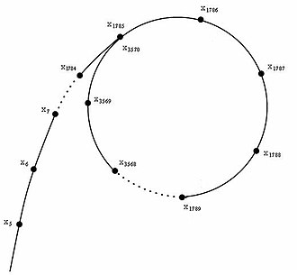

# Target

给定整数 $n$，求 $n$ 的所有质因子。

# Complexity

* Space:
  * Worst Case: $O(1)$
  * Amortized: $O(1)$
  * Best Case: $O(1)$
* Time:
  * Worst Case: $O(n)$
  * Amortized: $O(n^\frac{1}{4})$
  * Best Case: $O(\sqrt{p})$

# Solution

构造伪随机生成器 $g(x)$，则生成的序列为 $x_0$，$x_1 = g(x_0)$，$x_2 = g(g(x_0))$，$\ldots$，$x_n = g(x_{n-1})$。这时候我们发现当 $g(x)$ 的值域有限时它一定会重复，并且最终会成环（这也是为什么算法被称为 $\rho$ 的原因），如下图：

根据生日悖论，如果共存在 $m$ 种可能的值，则在成环之前出现的值的数量期望为 $\sqrt{m}$ 个。随后我们只需用 Floyd 判环算法找到这个环即可。因此算法的期望复杂度为 $O(\sqrt{m}) = O(n^\frac{1}{4})$，或者若最小因子为 $p$，其期望复杂度也可记为 $O(\sqrt{p})$。

事实上这个算法在分解大量数字的情况下性能不如借用线性筛的朴素算法好。

# Invocation

* `void pollard_rho(lli n, lli[] factors)`：随机化质因数分解 $n$，将结果无序地放入 $factors$ 中。
* `lli[] pollard_rho(lli n)`：随机化质因数分解 $n$，有序地返回所有质因子。例如若 $n = 2^3 \cdot 3$，则 $factors = [2, 2, 2, 3]$。

