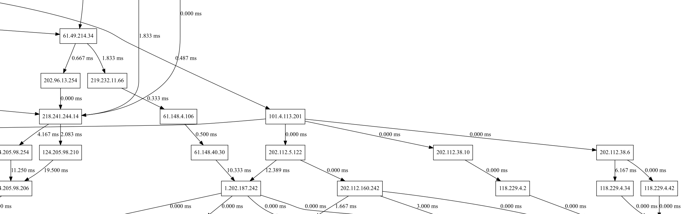

# kumoko

kumoko-net-cartographer is a network utility used to plot network structures. kumoko uses `traceroute` to detect network routing paths and extracts topological information from paths, attempting to restore network topology information between those endpoints and routers.


## Usage

```bash
pip install -r requirements.txt
python kumoko.py
```

Traceroute results are stored in the file `kumoko.db` under the current working directory. This certain file is to be loaded when exporting graphs and tables.

You may view the table by using this in the Python interpreter:

```python
>>> import kumoko
>>> k = kumoko.Kumoko()
>>> k.show()
```

Graphs can be exported to SVG format (other formats might not provide enough canvas size for a large graph) by invoking `k.export_graph()`.

The exported figure is drawn in the way as described below:

* Hops costing more than 30 ms are considered "gateway hops", and are coloured red.
* Routers on the side of "gateway hops" are called "gateway routers", and are coloured pink.
* Traceroute initiators are coloured lime.
* Traceroute target / endpoints are coloured blue.



## Backend

kumoko is a simple program utilizing these simple functions:

1. Resolve MX records to mail server domains.
2. Resolve A records to IPv4 addresses.
3. `ping` the target IPv4 addresses and check connectivity.
4. `traceroute` the target address.
5. Calculates the differences between delays in one single `traceroute`.
6. Average all edges and send to Graphviz using `dot` engine.

## Contribution

Pull requests are welcome. This utility also lacks a decent network interface.
